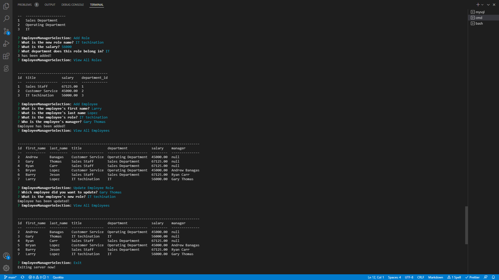

# SQL Employee Tracker

## Video Demonstration

(https://youtu.be/pULPkE806hs)

## Description

This software helps keep track of all employees salary, IDs, and their managers. You can create new users and assign them different roles like admin or manager. This software allow user to see how much money they are earning each day and how much they have earned overall.

## Table of Contents

- [Installation](#installation)
- [Run Command](#run-command)
- [Usage](#usage)
- [Questions](#questions)
- [Author](#author)

## Installation

Install with the following command

```
npm install express inquirer mysql2 console.table --save
```

## Run Command

To run the program, type in the following command in terminal

```
    node server.js
```

## Usage

This software allows you to create your own database of employees, their personal information, skills, and job duties. You can then assign each employee to a role or department based on their skill set. This will allow you to easily manage your employees and make sure they are doing what they should be doing.

## Questions

If you have any questions about the repo, open an issue or contact me directly at andrewbanagas40@gmail.com. You can find more of my work at [drew990](https://github.com/drew990/)

# Author

Andrew Banagas
